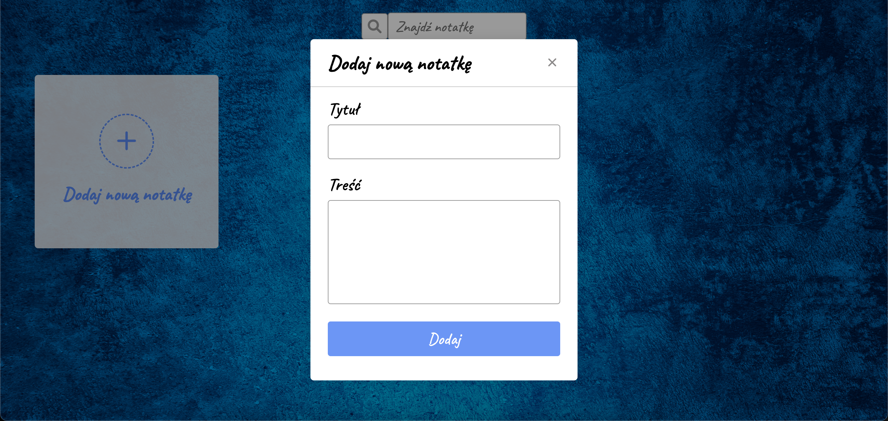

# QuickNote
An easy-to-use application built using JavaScript that saves your notes to your browser's local storage. You can perform easy operations on your notes and it is also mobile friendly.

#### Live demo [_here_](http://quicknote.pl/).

## Technologies Used
- HTML & CSS
- JavaScript

## Features
- Users can add, edit and delete short notes
- Users can find notes by individual note word
- Each note has a corresponding date
- Users can save notes to browser's local storage

## Screenshots

